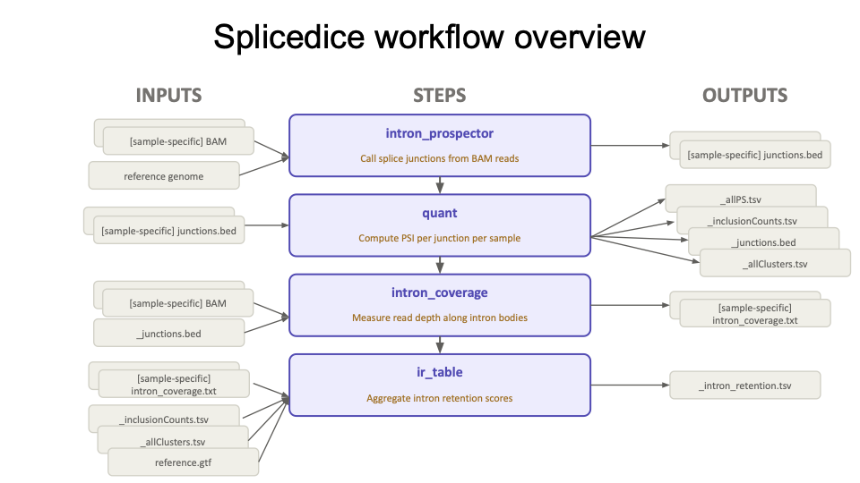
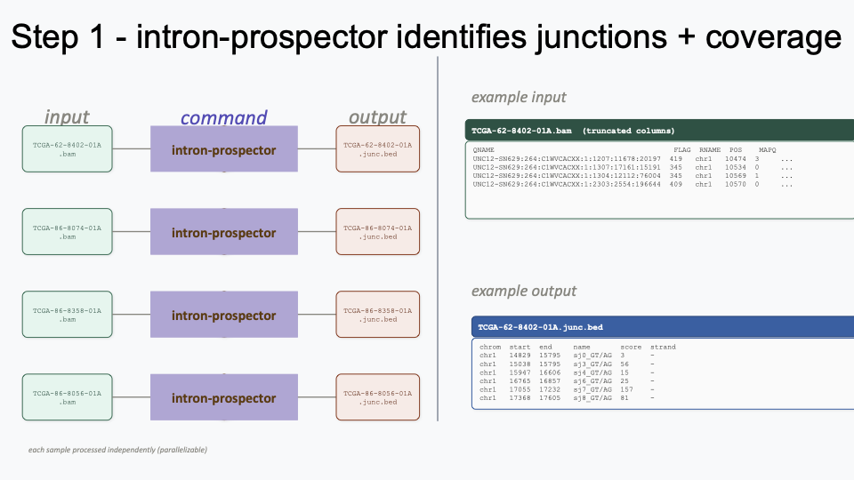
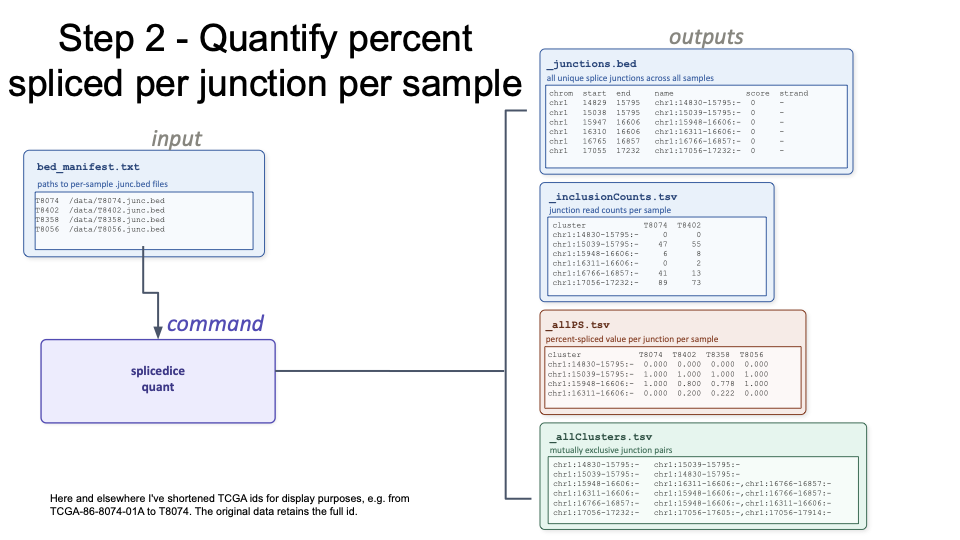
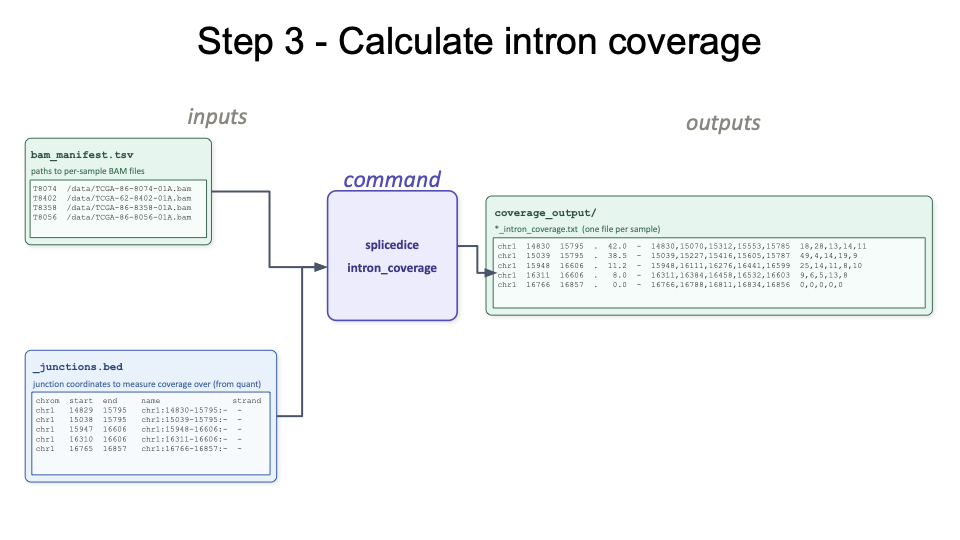
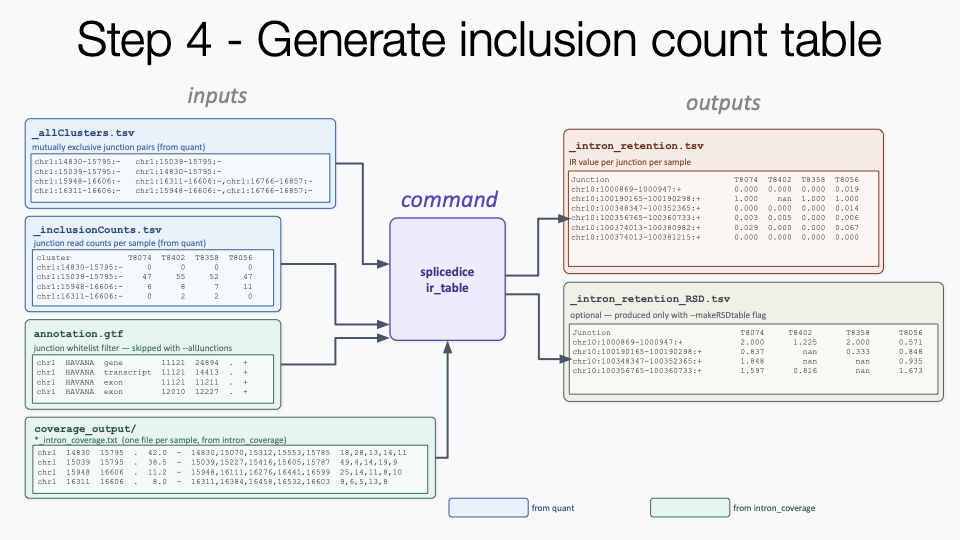

# SpliceDICE

Splice Divergent Interval Co-Exclusion (Splice DICE) is a tool for detecting and quantifying splicing events
by mutually exclusive junctions. This tool is currently in development and
user discretion is advised.



## Table of Contents

- [Dependencies](#dependencies)
- [Installation](#installation)
- [Usage](#usage)
  - [splicedice quant](#splicedice-quant)
    - [Output files](#output-files)
  - [Intron Retention](#intron-retention)
    - [splicedice intron_coverage](#splicedice-intron_coverage)
    - [splicedice ir_table](#splicedice-ir_table)
- [Manifest Format](#manifest-format)
  - [BED Manifest](#bed-manifest) (used by `quant`)
  - [BAM Manifest](#bam-manifest) (used by `intron_coverage`)
- [Contributing](#contributing)
- [License](#license)

## Dependencies

- Python 3.8+
- numpy==1.24.4
- pysam==0.23.3
- pandas==2.0.3

## Installation

Use git to clone the package and install with the package manager pip.

    $ git clone https://github.com/BrooksLabUCSC/splicedice.git
    $ cd splicedice/
    $ pip install --user .

### Development

If you are working on developing SpliceDICE it will likely be useful to install it in editable mode.

    $ pip install --user -e .

## Usage

SpliceDICE uses splice junction counts derived from aligned RNA sequencing reads to calculate a Percent-Spliced (PS) value for each junction.

Suggested tool for generating junction counts:

- intronProspector



### splicedice quant

Processes junction count files (BED6 files) to calculate a Percent-Spliced (PS) value for every splice junction in every sample in the manifest. Requires a [BED manifest](#bed-manifest).

BED input format (per sample file):

- Tab-delimited BED6 with columns: chrom, start, end, name, score, strand.
- Genomic coordinates must use 0-based, half-open BED convention (UCSC standard).
- score is used as the junction read count.
- strand must be + or -.

Input parameters:

- `-m, --manifest` (required): BED manifest file with sample names and bed file paths.
- `-o, --output_prefix` (required): prefix used for all generated output files.

```
$ splicedice quant -m bed_manifest.tsv -o output_prefix
```



#### Output files

- `{output_prefix}_allPS.tsv`: tab-separated table of PS values, where each column is a sample and each row is a splice junction.
- `{output_prefix}_allClusters.tsv`: tab-separated table of mutually exclusive junction clusters.
- `{output_prefix}_inclusionCounts.tsv`: raw junction read counts per sample.
- `{output_prefix}_junctions.bed`: BED file of all junctions observed across samples.

### Intron Retention

The percent-spliced value does not quantify intron retention. Two subprograms together produce an IR value table in the same format as the PS table.

#### splicedice intron_coverage

Measures coverage across previously identified splice junctions for each sample, producing a per-sample coverage file. Requires a [BAM manifest](#bam-manifest).

Input parameters:

- `-b, --bamManifest` (required): BAM manifest file with sample names and BAM file paths.
- `-j, --junctionFile` (required): junction BED file output from `splicedice quant`.
- `-n, --numThreads` (optional): number of BAM-parsing threads (default: 1).
- `-o, --outputDir` (required): directory for per-sample intron coverage output files.

```
$ splicedice intron_coverage \
    -b bam_manifest.tsv \
    -j output_prefix_junctions.bed \
    -n 4 \
    -o coverage_output_dir
```



#### splicedice ir_table

Takes per-sample coverage values from `intron_coverage` and calculates the IR value for each junction in each sample, outputting the final IR table.

Input parameters:

- `-i, --inclusionCounts` (required): `{output_prefix}_inclusionCounts.tsv` from `splicedice quant`.
- `-c, --clusters` (required): `{output_prefix}_allClusters.tsv` from `splicedice quant`.
- `-d, --coverageDirectory` (required): directory of per-sample coverage files from `splicedice intron_coverage`.
- `-o, --outputPrefix` (required): prefix for output files.
- `-a, --annotation` (required unless `-j`): GTF file with gene annotation.
- `-j, --allJunctions` (optional): output IR values for all junctions; default is annotated junctions only.
- `-n, --numThreads` (optional): number of parallel workers (default: 1).
- `-r, --makeRSDtable` (optional): also write a table of relative standard deviations in coverage.
- `-t, --RSDthreshold` (optional): RSD cutoff for junction inclusion (default: 1.0).
- `-s, --singleJunctionCalculation` (optional): calculate IR using individual junction counts rather than the full cluster count.

```
$ splicedice ir_table \
    -i output_prefix_inclusionCounts.tsv \
    -c output_prefix_allClusters.tsv \
    -d coverage_output_dir \
    -n 4 \
    -o project_output_prefix
```



## Manifest Format

Manifests are tab-delimited files with one sample per line. The first column is the sample identifier, the second is the absolute path to the relevant file, and the third is an optional metadata label (e.g. condition) for your own reference — it is not used by SpliceDICE.

### BED Manifest

Used by `splicedice quant`. The second column is the path to the BED6 junction file for that sample.

```
SRR12801019	/path/to/intron_beds/SRR12801019.bed	control
SRR12801020	/path/to/intron_beds/SRR12801020.bed	SUGP1_kd
SRR12801023	/path/to/intron_beds/SRR12801023.bed	control
SRR12801024	/path/to/intron_beds/SRR12801024.bed	SUGP1_kd
SRR12801027	/path/to/intron_beds/SRR12801027.bed	control
SRR12801028	/path/to/intron_beds/SRR12801028.bed	SUGP1_kd
```

### BAM Manifest

Used by `splicedice intron_coverage`. The second column is the path to the BAM file for that sample.

```
SRR12801019	/path/to/bams/SRR12801019.bam	control
SRR12801020	/path/to/bams/SRR12801020.bam	SUGP1_kd
SRR12801023	/path/to/bams/SRR12801023.bam	control
SRR12801024	/path/to/bams/SRR12801024.bam	SUGP1_kd
SRR12801027	/path/to/bams/SRR12801027.bam	control
SRR12801028	/path/to/bams/SRR12801028.bam	SUGP1_kd
```

## Contributing

Pull requests are welcome. For major changes, please open an issue first to discuss what you would like to change.

Please include tests as appropriate.

## License

BSD-3
